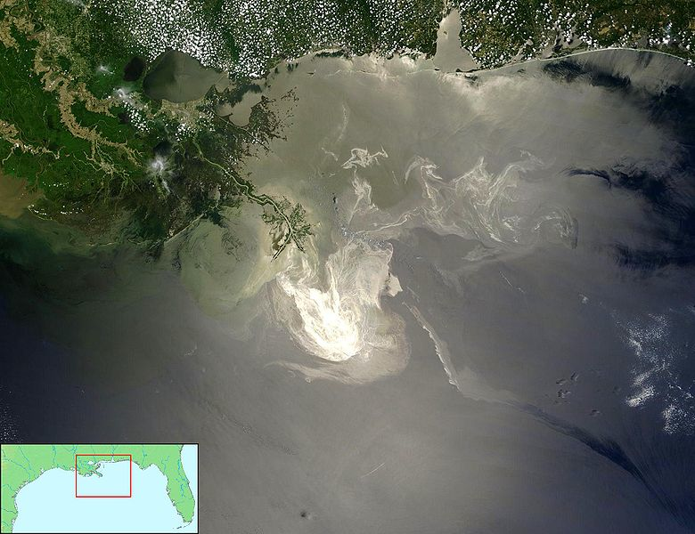
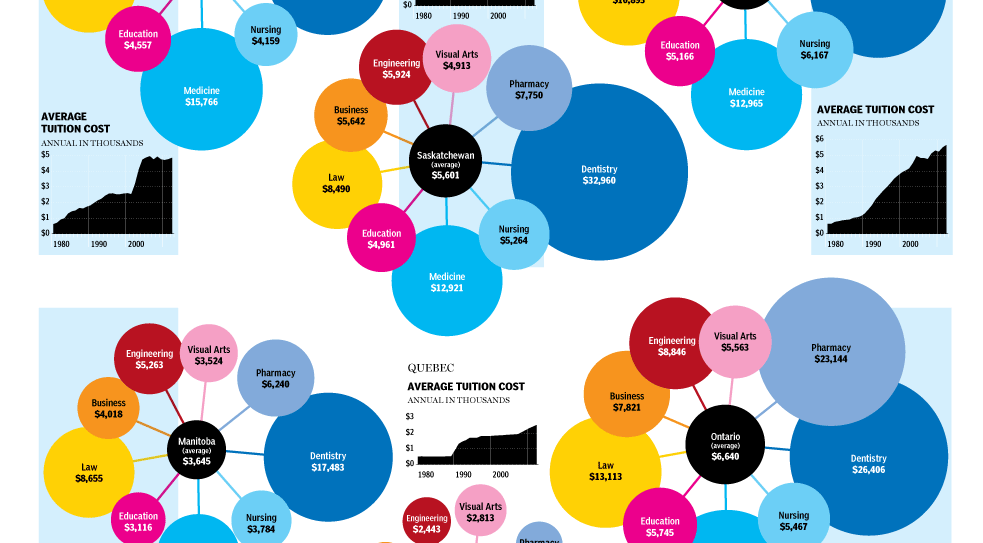
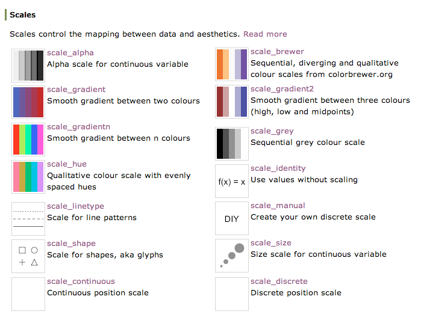
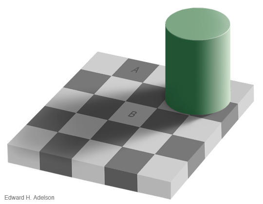

```{r setup, include=FALSE}
knitr::opts_chunk$set(echo = T, comments = T, collapse = T,
                      fig.width = 7, fig.height = 4, cache = T)
```

```{r, echo=FALSE}
library(ggplot2)
```

# Basic Plots

## Setup

Run the [Setup.R](./code/Setup.R) file.

If everything works correctly, you should see a plot:
```{r, echo = F, fig.width = 7, fig.height = 4}
qplot(rnorm(100), rnorm(100), color = rbinom(100, 5, 0.2))
```

## ggplot2 In a Nutshell

- Package for statistical graphics
- Developed by Hadley Wickham
- Designed to adhere to good graphical practices
- Supports a wide variety plot types
- Constructs plots using the concept of layers\medskip
- http://had.co.nz/ggplot2/ or Hadley's book *ggplot2: Elegant Graphics for Data Analysis}* for reference material


## *qplot* Function

The *qplot()* function is the basic workhorse of ggplot2

- Produces all plot types available with ggplot2
- Allows for plotting options within the function statement
- Creates an object that can be saved
- Plot layers can be added to modify plot complexity

## *qplot* Structure

The *qplot()* function has a basic syntax:

*qplot(variables, plot type, dataset, options)*

- variables: list of variables used for the plot
- plot type: specified with a *geom =* statement
- dataset: specified with a *data =* statement
- options: there are so, so many options!


## Diamonds Data

Objective: Explore the diamonds data set (preloaded along with ggplot2) using `qplot` for basic plotting.

The data set was scraped from a diamond exchange company data base.  It contains the prices and attributes of over 50,000 diamonds.


## Examining the Diamonds Data

What does the data look like?

Look at the top few rows of the diamond data frame to find out!

```{r}
head(diamonds)
```


## Basic Scatterplot

Basic scatter plot of diamond price vs. carat weight

```{r, fig.height=4, fig.width=7}
qplot(carat, price, geom = "point", data = diamonds)
```

***
### Another Scatterplot

Scatter plot of diamond price vs carat weight showing versitility of options in `qplot`

```{r, fig.height=3, fig.width=7}
qplot(carat, log(price), geom = "point", data = diamonds, 
      alpha = I(0.2), color = color, 
      main = "Log price by carat weight, grouped by color") + 
  xlab("Carat Weight") + ylab("Log Price")
```

## Your Turn {.yourturn  data-background=#527a7a}

All of the "Your Turns" for this section will use the tips data set:

```{r}
tips <- read.csv("https://bit.ly/2gGoiLR")
```

1. Use qplot to build a scatterplot of variables tips and total bill
2. Use options within qplot to color points by smokers
3. Clean up axis labels and add main plot title

## Solutions {.solutions  data-background=#527a7a}
1. Scatterplot of variables tips and total bill
```{r}
qplot(data = tips, x = total_bill, y = tip)
```

## Solutions {.solutions  data-background=#527a7a}
2. Color points by smokers
```{r, tidy = F}
qplot(data = tips, x = total_bill, y = tip, color = smoker)
```

## Solutions {.solutions  data-background=#527a7a}
3. Pretty axis lables and title
```{r, tidy = F, fig.width = 7, fig.height = 3}
qplot(data = tips, x = total_bill, y = tip, color = smoker,
      xlab = "Total Bill ($)", ylab = "Tip ($)", 
      main = "Tip left by patrons' total bill and smoking status")
```

# Plotting Map Data

## States Data

To make a map, load up the states data and take a look:

```{r}
states <- map_data("state")
head(states)
```

## Basic Map Data

What data is needed in order to plot a basic map?

- Latitude/longitude points for all map boundaries
- Which boundary group all lat/long points belong
- The order to connect points within each group

## Basic Map Data

The *states* data has all necessary information

## A Basic Map

A bunch of latitude longitude points...

```{r, fig.height=4, fig.width=7}
qplot(long, lat, geom = "point", data = states)
```

## A Bit Better Map

... that are connected with lines in a very specific order.

```{r, fig.height=4, fig.width=7}
qplot(long, lat, geom = "path", data = states, group = group) + 
  coord_map()
```

## Polygon vs Path

```{r, fig.height=4, fig.width=7}
qplot(long, lat, geom = "polygon", data = states, group = group) + 
  coord_map()
```

## Polygon vs Path
```{r, fig.height = 4, fig.width = 7}
qplot(long, lat, geom = "polygon", 
      fill = I("white"), color = I("black"),
      data = states, group = group) + 
  coord_map()
```

## Incorporating Information

- Add other geographic information by adding geometric layers to the plot
- Add non-geopgraphic information by altering the fill color for each state
- Use `geom = "polygon"` to treat states as solid shapes
- Show numeric information with color shade/intensity
- Show categorical information using color hue

## Categorical Data

If a categorical variable is assigned as the fill color then `qplot` will assign different hues for each category. 

Load in a state regions dataset:

```{r, echo = 2:3}
statereg <- read.csv("https://srvanderplas.github.io/NPPD-Analytics-Workshop/02.Graphics/data/statereg.csv")
statereg <- read.csv("https://bit.ly/2i0AFHK")
head(statereg)
```

## Joining Data

`join` or `merge` the original states data with new info 

The `left_join` function is used for merging\*\*:

```{r, message = F, warning = F}
library(dplyr)
states.class.map <- left_join(states, statereg, by = c("region" = "State"))
head(states.class.map)
```

\*\* More on this later

## Plotting the Result

```{r, fig.height=4, fig.width=7}
qplot(long, lat, geom = "polygon", data = states.class.map, 
      group = group, fill = StateGroups, color = I("black")) + 
  coord_map() 
```

## Numerical Data & Maps

- Behavioral Risk Factor Surveillance System
- 2008 telephone survey run by the Center for Disease Control (CDC)
- Ask a variety of questions related to health and wellness
- Cleaned data with state aggregated values posted on website

## BRFSS Data Aggregated by State

```{r, echo = 2:3}
states.stats <- read.csv("https://srvanderplas.github.io/NPPD-Analytics-Workshop/02.Graphics/data/states.stats.csv")
states.stats <- read.csv("https://bit.ly/2gT95Hc")

head(states.stats)
```

## Join the data again

```{r, message = F, warning = F}
states.map <- left_join(states, states.stats, by = c("region" = "state.name"))
head(states.map)
```

## Shade and Intensity

Average # of days in the last 30 days of insufficient sleep

```{r, fig.height=3, fig.width=7}
qplot(long, lat, geom = "polygon", data = states.map, 
      group = group, fill = avg.qlrest2) + coord_map()
```

## BRFSS Data by Gender and State

```{r}
states.sex.stats <- read.csv("https://srvanderplas.github.io/NPPD-Analytics-Workshop/02.Graphics/data/states.sex.stats.csv")
states.sex.stats <- read.csv("https://bit.ly/2hiKFIb")
head(states.sex.stats)
```

## One More Join

```{r, warning = F, message = F}
states.sex.map <- left_join(states, states.sex.stats, by = c("region" = "state.name"))
head(states.sex.map)
```

## Adding Information

Average # of alcoholic drinks per day by state and gender

```{r, fig.height=3, fig.width=7}
qplot(long, lat, geom = "polygon", data = states.sex.map, 
      group = group, fill = avg.drnk) + coord_map() + 
  facet_grid(sex ~ .)
```

## Your Turn {.yourturn  data-background=#527a7a}

- Use `left_join` to combine child healthcare data with maps information.     
You can load in the child healthcare data with:

```{r}
states.health.stats <- read.csv("https://bit.ly/2hRBMq0")
```

- Use `qplot` to create a map of child healthcare undercoverage rate by state

## Solutions {.solutions  data-background=#527a7a}
```{r, eval = F}
library(maps)
library(dplyr)
states <- map_data("state")
states.health.map <- left_join(states, states.health.stats, 
                               by = c("region" = "state.name"))

# Use qplot to create a map of child healthcare undercoverage 
# rate by state

qplot(data = states.health.map, x = long, y = lat, 
      geom = 'polygon', group = group, 
      fill = no.coverage) + coord_map()
```

## Solutions {.solutions  data-background=#527a7a}
```{r, eval = T, echo = F, message = F, warning = F}
library(maps)
library(dplyr)
states <- map_data("state")
states.health.map <- left_join(states, states.health.stats, 
                               by = c("region" = "state.name"))

# Use qplot to create a map of child healthcare undercoverage rate by state

qplot(data = states.health.map, x = long, y = lat, geom = 'polygon',
      group = group, fill = no.coverage) + coord_map()
```

## Cleaning Up Maps

Use ggplot2 options to clean up the map!

- Adding Titles `+ ggtitle(...)`
- Might want a plain white background `+ theme_bw()`
- Extremely familiar geography may eliminate need for latitude and longitude axes `+ theme(...)`
- Want to customize color gradient `+ scale_fill_gradient2(...)`
- Keep aspect ratios correct `+ coord_map()`

## Cleaned Up Map

```{r, fig.height=4.28, fig.width=10, eval = F, tidy = F}
qplot(long, lat, geom = "polygon", data = states.map, 
      group = group, fill = avg.drnk) + 
  coord_map() +  theme_bw() +
  scale_fill_gradient2(
    name = "Avg Drinks",
    limits = c(1.5, 3.5), 
    low = "lightgray", high = "red") + 
  theme(axis.ticks = element_blank(),
        axis.text = element_blank(),
        axis.title = element_blank()) +
  ggtitle("Average Number of Alcoholic Beverages 
          Consumed Per Day by State")
```

## Cleaned Up Map
```{r, fig.height=4.28, fig.width=10, echo = F}
qplot(long, lat, geom = "polygon", data = states.map, 
      group = group, fill = avg.drnk) + 
  coord_map() +  theme_bw() +
  scale_fill_gradient2(
    name = "Avg Drinks",
    limits = c(1.5, 3.5), 
    low = "lightgray", high = "red") + 
  theme(axis.ticks = element_blank(),
        axis.text = element_blank(),
        axis.title = element_blank()) +
  ggtitle("Average Number of Alcoholic Beverages Consumed Per Day by State")
```

## Your Turn {.yourturn  data-background=#527a7a}

Use options to polish the look of your map of child healthcare undercoverage rate by state!

## Solutions  {class=solutions data-background=#527a7a}
```{r, eval = F}
qplot(data = states.health.map, x = long, y = lat, 
      geom = 'polygon', group = group, fill = no.coverage) + 
  coord_map() + 
  scale_fill_gradient2(
    name = "Child\nHealthcare\nUndercoverage",
    limits = c(0, .2), 
    low = 'white', high = 'red') + 
  ggtitle("Health Insurance in the U.S.\n
          Which states have the highest rates 
          of undercovered children?") +
  theme_minimal() + 
  theme(panel.grid = element_blank(), 
        axis.text = element_blank(),
        axis.title = element_blank())	
```

## Solutions {.solutions data-background=#527a7a}

```{r, echo = F}
library(maps)
library(dplyr)
qplot(data = states.health.map, x = long, y = lat, 
      geom = 'polygon', group = group, fill = no.coverage) + 
  coord_map() + 
  scale_fill_gradient2(
    name = "Child\nHealthcare\nUndercoverage",
    limits = c(0, .2), 
    low = 'white', high = 'red') + 
  ggtitle("Health Insurance in the U.S.\n
          Which states have the highest rates of undercovered children?") +
  theme_minimal() + 
  theme(panel.grid = element_blank(), 
        axis.text = element_blank(),
        axis.title = element_blank())	
```


# Plotting Using Layers

```{r, echo=FALSE, message=FALSE}
library(ggplot2)

states <- map_data("state")
```

***

### Deepwater Horizon Oil Spill


## Datasets

#### NOAA Data:

- National Oceanic and Admin. 
- Temperature and Salinity in the Gulf of Mexico
- Measured using Floats, Gliders and Boats

## Datasets

#### US Fisheries and Wildlife Data:

- Animal Sightings on the Gulf Coast
- Birds, Turtles and Mammals
- Status: Oil Covered or Not

Both data sets have geographic coordinates for every observation

## Loading NOAA Data

NOAA data is a .rdata file. Read it in:

1. Download the data [here](https://srvanderplas.github.io/NPPD-Analytics-Workshop/02.Graphics/data/noaa.rdata)
2. Run the `getwd()` command to find your current working directory
3. Place noaa.rdata in the directory from step 2.
4. Run the command below:

```{r, eval=FALSE}
load("noaa.rdata")
```

```{r, echo=FALSE, message = F}
library(ggplot2)
states <- map_data("state")
load("./data/noaa.rdata")
```


## Floats

Take a peek at the top of the floats NOAA data:

```{r}
head(floats, n = 2)[,1:5]
head(floats, n = 2)[,6:10]
head(floats, n = 2)[,11:14]
```

## Floats

```{r, fig.height=4, fig.width=7}
qplot(Longitude, Latitude, color = callSign, data = floats) + 
  coord_map()
```

## Gliders

```{r, fig.height=4, fig.width=7}
qplot(Longitude, Latitude, color = callSign, data = gliders) + 
  coord_map()
```

## Boats

```{r, fig.height=4, fig.width=7}
qplot(Longitude, Latitude, color = callSign, data = boats) + 
  coord_map()
```

## Layering

This data has the same context - a common time and common place

- Want to aggregate information from different sources onto a common plot
- Start with a common background the lat/long grid
- Superimpose data onto the grid in layers using `ggplot2`

## Layers Preview

```{r, fig.height=3, fig.width=7, warning=FALSE}
ggplot() +
  geom_path(data = states, aes(x = long, y = lat, group = group)) + 
  geom_point(data = floats, aes(x = Longitude, y = Latitude, color = callSign)) +   
  geom_point(aes(x, y), shape = "x", size = 5, data = rig) + 
  geom_text(aes(x, y), label = "BP Oil Rig", 
            size = 5, data = rig, hjust = -0.1) + 
  xlim(c(-91, -80)) + ylim(c(22,32)) + coord_map()
```


## More Layering

- Most maps (and many plots) have multiple layers of data. 
- The layers may be from the same or different datasets.
- ggplot2 makes it easy to add layers to a plot.

## What is a Plot?

- A default dataset 
- A coordinate system
- layers of geometric objects (geoms)
- A set of aesthetic mappings (taking information from the data and converting into an attribute of the plot)
- A scale for each aesthetic
- A facetting specification (multiple plots based on subsetting the data)


## Floats Decomposed

**Data**: floats, states

<table>
<tr>
<td>
**Mappings**: 
<table>
<tr>
<td>aesthetic</td><td> mapping</td>
</tr>
<tr>
<td>x</td><td>Longitude</td>
</tr>
<tr>
<td>y</td><td>Latitude</td>
</tr>
<tr>
<td>color</td><td>CallSign</td>
</tr>
</table>
</td>
<td>
**Scales**:
<table>
<tr>
<td>aesthetic</td><td> scale</td>
</tr>
<tr>
<td>x</td><td>continuous</td>
</tr>
<tr>
<td>y</td><td>continuous</td>
</tr>
<tr>
<td>color</td><td>discrete</td>
</tr>
</table>
</td>
</tr>
</table>
**Geoms**: Points (floats), lines (states)

**Facetting**: None

## `qplot` vs `ggplot`

`qplot()` stands for "quickplot":

- Automatically chooses default settings to make life easier
- Less control over plot construction

`ggplot()` stands for "grammar of graphics plot"

- Contructs the plot using components listed in previous slides

## `qplot` vs `ggplot`

Two ways to construct the same plot for float locations:

```{r, eval=FALSE}
qplot(Longitude, Latitude, color = callSign, data = floats) 
```

Or:

```{r, eval=FALSE}
ggplot(data = floats, 
       aes(x = Longitude, y = Latitude, color = callSign)) +
  geom_point() + 
  scale_x_continuous() + 
  scale_y_continuous() + 
  scale_color_discrete()
```

## Brevity
Even `ggplot` will automatically pick default scales:

```{r, fig.height=3, fig.width=7}
ggplot(data = floats, 
       aes(x = Longitude, y = Latitude, color = callSign)) +
  geom_point()
```


## Your Turn {.yourturn  data-background=#527a7a}

Find the `ggplot()` statement that creates this plot:

```{r, fig.height=4, fig.width=7, echo=FALSE, warning=FALSE}
ggplot(aes(x = Depth, y = Temperature, color = callSign), data = floats) + geom_point()
```

Hint: look at the Floats data for variable ideas

## Solutions {.solutions  data-background=#527a7a}
```{r, fig.height=4, fig.width=7, echo=TRUE, warning=FALSE}
ggplot(aes(x = Depth, y = Temperature, color = callSign), 
       data = floats) + 
  geom_point()
```


## What is a Layer?

A layer added `ggplot()` can be a geom...

- The type of geometric object
- The statistic mapped to that object
- The data set from which to obtain the statistic

... or a position adjustment to the scales

- Changing the axes scale
- Changing the color gradient


## Layer Examples

Plot               Geom             Stat
------------------ ---------------- -----------------
Scatterplot        point            identity
Histogram          bar              bin count
Smoother           line + ribbon    smoother function
Binned Scatterplot rectange + color 2d bin count

More geoms described at http://docs.ggplot2.org/current/

## Piecing Things Together

Build a map using NOAA data

- Coordinate system (mapping Long-Lat to X-Y)
- Add layer of state outlines
- Add layer of points for float locations
- Add layers for Oil Rig marker and label
- Adjust the range of x and y scales


## The Result

```{r, fig.height=3, fig.width=7, warning=FALSE}
ggplot() +
  geom_path(data = states, aes(x = long, y = lat, group = group)) + 
  geom_point(data = floats, aes(x = Longitude, y = Latitude, color = callSign)) +   
  geom_point(aes(x, y), shape = "x", size = 5, data = rig) + 
  geom_text(aes(x, y), label = "BP Oil Rig", size = 5, data = rig, hjust = -0.1) + 
  xlim(c(-91, -80)) + 
  ylim(c(22, 32)) + coord_map()
```


## Your Turn {.yourturn  data-background=#527a7a}
```{r}
animal <- read.csv("https://bit.ly/2hNlTUl")
```
1. Read in the animal.csv data:    
(Data of animal sightings around the Deepwater Site)
2. Plot the location of animal sightings on a map of the region
3. On this plot, try to color points by class of animal and/or status of animal
4. **Advanced**: Is there a way to indicate time?

```{r}
library(lubridate)
animal$month <- month(as.Date(animal$Date_))
```

## Solutions {.solutions  data-background=#527a7a}

2. Plot the location of animal sightings on a map

```{r, echo=TRUE, warning=FALSE, eval = F}
ggplot() + 
  geom_path(data = states, aes(x = long, y = lat, group = group)) + 
  geom_point(data = animal, aes(x = Longitude, y = Latitude)) + 
  xlim(c(-91, -80)) + ylim(c(24,32)) + coord_map()
```

## Solutions {.solutions  data-background=#527a7a}

2. Plot the location of animal sightings on a map
```{r, echo=F, warning=FALSE}
ggplot() + 
  geom_path(data = states, aes(x = long, y = lat, group = group)) + 
  geom_point(data = animal, aes(x = Longitude, y = Latitude)) + 
  xlim(c(-91, -80)) + ylim(c(24,32)) + coord_map()
```


## Solutions {.solutions  data-background=#527a7a}

3. On this plot, try to color points by class of animal and/or status of animal
```{r, echo=TRUE, eval = F, warning=FALSE}
ggplot() + 
  geom_path(data = states, aes(x = long, y = lat, group = group)) + 
  geom_point(data = animal, aes(x = Longitude, y = Latitude, 	
                                color = class)) + 
  xlim(c(-91, -80)) + ylim(c(24,32)) + coord_map()
```
## Solutions {.solutions  data-background=#527a7a}

3. On this plot, try to color points by class of animal and/or status of animal
```{r, echo=F, warning=FALSE}
ggplot() + 
  geom_path(data = states, aes(x = long, y = lat, group = group)) + 
  geom_point(data = animal, aes(x = Longitude, y = Latitude, 	
                                color = class)) + 
  xlim(c(-91, -80)) + ylim(c(24,32)) + coord_map()
```

## Solutions {.solutions  data-background=#527a7a}

3. On this plot, try to color points by class of animal and/or status of animal
```{r, echo=TRUE, eval = F, warning=FALSE}
ggplot() + 
  geom_path(data = states, aes(x = long, y = lat, group = group)) + 
  geom_point(data = animal, aes(x = Longitude, y = Latitude, 	
                                color = Condition)) + 
  xlim(c(-91, -80)) + ylim(c(24,32)) + coord_map()
```
## Solutions{class=solutions data-background=#527a7a}

3. On this plot, try to color points by class of animal and/or status of animal
```{r, echo=F, warning=FALSE}
ggplot() + 
  geom_path(data = states, aes(x = long, y = lat, group = group)) + 
  geom_point(data = animal, aes(x = Longitude, y = Latitude, 	
                                color = Condition)) + 
  xlim(c(-91, -80)) + ylim(c(24,32)) + coord_map()
```


## Solutions {.solutions  data-background=#527a7a}
4. **Advanced**: Is there a way to indicate time?
```{r, echo=TRUE, eval = F, warning=FALSE}
ggplot() + 
  geom_path(data = states, aes(x = long, y = lat, group = group)) + 
  geom_point(data = animal, aes(x = Longitude, y = Latitude, 	
                                color = Condition), alpha = .5) +
  xlim(c(-91, -80)) + ylim(c(24,32)) +
  facet_wrap(~month) + coord_map() 	
```

## Solutions {.solutions  data-background=#527a7a}
4. **Advanced**: Is there a way to indicate time?
```{r, echo=F, warning=FALSE}
ggplot() + 
  geom_path(data = states, aes(x = long, y = lat, group = group)) + 
  geom_point(data = animal, aes(x = Longitude, y = Latitude, 	
                                color = Condition), alpha = .5) +
  xlim(c(-91, -80)) + ylim(c(24,32)) +
  facet_wrap(~month) + coord_map() 	
```

# Perception

## Motivation

### Why are some plots easier to read than others?

---

### Cost of an Education



## Good Graphics

Graphics consist of:

- Structure (boxplot, scatterplot, etc.)
- Aesthetics: features such as 
    - color
    - shape
    - size     
that map other characteristics to structural features

Both the structure and aesthetics should help viewers interpret the information.

***

### Pre-Attentive Features

- Things that "jump out" in less than 250 ms
- Color, form, movement, spatial localization

```{r, echo=FALSE, message=FALSE, warning=FALSE, fig.height=4, fig.width=7}
library(scales)
library(ggplot2)

data <- data.frame(expand.grid(x = 1:6, y = 1:6), color = sample(c(1, 2), 36, replace = TRUE))
data$x <- data$x + rnorm(36, 0, .25)
data$y <- data$y + rnorm(36, 0, .25)
data$shape <- c(rep(2, 15), 1, rep(2,20))

new_theme_empty <- theme_bw()
new_theme_empty$line <- element_blank()
new_theme_empty$rect <- element_blank()
new_theme_empty$strip.text <- element_blank()
new_theme_empty$axis.text <- element_blank()
new_theme_empty$plot.title <- element_blank()
new_theme_empty$axis.title <- element_blank()
new_theme_empty$plot.margin <- structure(c(0, 0, -1, -1), unit = "lines", valid.unit = 3L, class = "unit")

qplot(x, y, data = data, color = factor(1, levels = 1:2), shape = factor(shape), size = I(5)) +
  scale_shape_manual(guide = "none", values = c(19, 15)) + 
  scale_color_discrete(guide = "none") + 
  new_theme_empty
```

***
### Pre-Attentive Features


```{r, fig.height=4, fig.width=7, echo=FALSE}
data$shape <- c(rep(2, 25), 1, rep(2, 10))
qplot(x, y, data = data, color = factor(shape), shape = I(19), size = I(5)) +
  scale_shape_manual(guide = "none", values = c(19, 15)) + 
  scale_color_discrete(guide = "none") + 
  new_theme_empty
```

***
### Hierarchy of Features

- Color is stronger than shape
- Combinations of pre-attentive features are usually not pre-attentive due to **interference**

```{r, fig.height=4, fig.width=7, echo=FALSE}
data$shape2 <- data$color
qplot(x, y, data = data, color = factor(color), shape = factor(shape2), size = I(5)) +
  scale_shape_manual(guide = "none", values = c(19, 15)) + 
  scale_color_discrete(guide = "none") + 
  new_theme_empty
```

***
### Hierarchy of Features

- Color is stronger than shape
- Combinations of pre-attentive features are usually not pre-attentive due to **interference**

```{r, fig.height=4, fig.width=7, echo=FALSE}
set.seed(33201)
data <- data.frame(expand.grid(x = 1:6, y = 1:6), color = sample(c(1, 2), 36, replace = TRUE))
data$x <- data$x + rnorm(36, 0, .25)
data$y <- data$y + rnorm(36, 0, .25)
data$shape2 <- data$color

data$shape2[16] <- if (data$shape2[16] == 2) 1 else 2

qplot(x, y, data = data, color = factor(color), shape = factor(shape2), size = I(5)) +
  scale_shape_manual(guide = "none", values = c(19, 15)) + 
  scale_color_discrete(guide = "none") + 
  new_theme_empty
```


## Your Turn {.yourturn  data-background=#527a7a}

Find ways to improve the following graphic:

```{r, fig.height=2, fig.width=7, out.width = "60%"}
frame <- read.csv("https://bit.ly/2i3Q4Gf")
qplot(x, y, data = frame, shape = g1, colour = g2, size = I(4))
```

- Make sure the "oddball" stands out while keeping the information on the groups
- Hint: `interaction` combines factor variables

## Solutions {.solutions  data-background=#527a7a}

```{r, fig.height=4, fig.width=7, out.width = "60%"}
# Make sure the "oddball" stands out while keeping the 
# information on the groups
frame$inter <- interaction(frame$g1, frame$g2)
ggplot(frame, aes(x, y)) +  
  geom_point(aes(shape = g1, color = inter), size = I(4))
```

## Solutions

```{r, fig.height=3, fig.width=7, out.width = "60%"}
# Make sure the "oddball" stands out while keeping the 
# information on the groups
frame$inter <- interaction(frame$g1, frame$g2)
ggplot(frame, aes(x, y)) +  
  geom_point(aes(shape = g1, fill = g2, color = inter), size = I(4), stroke = I(2)) + 
  scale_shape_manual(values = c(21,23)) + 
  scale_fill_manual(values = c("red", "green")) + 
  scale_colour_manual(values = c("red", "black", "green")) + 
  guides(fill = guide_legend(override.aes = list(color = c("red", "green"))),
         colour = guide_legend(override.aes = list(fill = "white", shape = 22)))
```

***
### Accuracy of Perception

1. Position (common scale)    
e.g. bar chart, scatter plot, line graph
2. Position (non-aligned scale)    
e.g. stacked bar chart
3. Length, Direction, Angle, Slope
4. Area
5. Volume, Density, Curvature
6. Shading, Color Saturation, Color Hue

***
### Accuracy of Perception

Using the previous list, which is a more accurate way to display the same data:

1. A pie chart
2. A bar chart

***
### Accuracy of Perception

Using the previous list, which is a more accurate way to display the same data:

1. A pie chart
2. **A bar chart**

A bar chart displays information on a common aligned scale. A pie chart requires comparisons of angles and/or area, which are less accurate.

***
### Accuracy of Perception

If you have observations of height and weight over time, and height is more important than weight, how would you construct your plot?

aesthetic | variable
:-------- | :-------
x|     
y|     
color|    

***
### Accuracy of Perception

If you have observations of height and weight over time, and height is more important than weight, how would you construct your plot?

aesthetic | variable
:-------- | :-------
x| time
y| height
color| weight

Since height is more important to show, it should be displayed using a position scale. Weight is less important, so it should be shown using a color scale. 

***
### Aesthetics in `ggplot2`

Main parameters: alpha, shape, color, size




## Ordering Variables

- Position:    
higher is larger (y), items to the right are larger (x)
- Size, Area
- Color: not always ordered. More contrast = larger
- Shape: Unordered. 

```{r, echo=FALSE, fig.width=7, fig.height=2.5}
library(RColorBrewer)
library(gridExtra)

data <- data.frame(x = c(1, 2, 3, 4, 5), 
                   y = c(1, 4, 9, 10, 12), 
                   size = c(1, 4, 2, 1, 5))

p1 <- qplot(x, y, data = data, size = size, geom = "point") + 
  scale_size_continuous(range = c(2.5, 5), guide = "none") + 
  theme_bw()  + 
  theme(axis.text = element_blank())

data <- data.frame(x = factor(c(1, 2, 3, 4, 5)), 
                   y = c(4, 3, 1, 5, 2))

p2 <- ggplot(data = data, aes(x = x, weight = y)) + 
  geom_bar() + 
  theme_bw() + 
  theme(axis.text = element_blank())

data <- data.frame(expand.grid(x = 1:6, y = rev(1:3)), 
                   color = c(brewer.pal(7, "Blues")[2:7],
                             brewer.pal(6, "Set1"), 
                             rep("black", 6)),
                   shape = c(rep(19, 6), rep(19, 6), 21:25, 8))

p3 <- ggplot(data = data, aes(x = x, y = factor(y), color = color, fill = color, shape = shape)) + 
  geom_point(size = 5) + 
  scale_fill_identity() + 
  scale_color_identity() + 
  scale_shape_identity() + 
  ylab("") + 
  xlab("") + 
  theme_bw() + 
  theme(axis.text = element_blank(), axis.ticks = element_blank(), axis.title = element_blank(), 
        panel.grid = element_blank(), panel.background = element_blank())

grid.arrange(p1, p2, p3, nrow = 1)
```


## Color

- Hue: shade of color (red, orange, yellow...)
- Intensity: amount of color
- Both color and hue are pre-attentive.    
Bigger contrast corresponds to faster detection.

## More Color

Color is context-sensitive: 



## More Color

Color is context-sensitive: 


A and B are the same intensity and hue, but appear to be different.

## More Color

Color is context-sensitive: 


A and B are the same intensity and hue, but appear to be different.

## Gradients

Qualitative schemes: no more than 7 colors

```{r, echo=FALSE, fig.width=7, fig.height=1.5}
data <- data.frame(x = 1:7, 
                   blues = brewer.pal(7, "Blues"), 
                   set1 = brewer.pal(7, "Set1"), 
                   diverge = brewer.pal(7,"RdBu"))

qplot(xmin = x-.5, xmax = x+.5, ymin = 0, ymax = 1, data = data, geom = "rect", color = I("black"), fill = set1) + 
    scale_fill_identity() + 
    ylab("") + 
    xlab("") + 
    theme(axis.text = element_blank(), 
          axis.ticks = element_blank(), 
          rect = element_blank()) + 
    coord_fixed(ratio = 1) + 
    new_theme_empty
```

Quantitative schemes: use color gradient with only one hue for positive values

```{r, echo=FALSE, fig.width=7, fig.height=1.5}
qplot(xmin = x-.5, xmax = x+.5, ymin = 0, ymax = 1, data = data, geom = "rect", color = I("black"), fill = blues) + 
    scale_fill_identity() + 
    ylab("") + 
    xlab("") + 
    theme(axis.text = element_blank(), 
          axis.ticks = element_blank(), 
          rect = element_blank()) + 
    coord_fixed(ratio = 1) + 
    new_theme_empty
```


## More Gradients

Quantitative schemes: use color gradient with two hues for positive and negative values.    
Gradient should go through a light, neutral color (white) corresponding to 0.

```{r, echo=FALSE, fig.width=7, fig.height=1.5}
qplot(xmin = x - .5, xmax = x + .5, ymin = 0, ymax = 1, 
      data = data, geom = "rect", color = I("black"), fill = diverge) + 
    scale_fill_identity() + 
    ylab("") + 
    xlab("") + 
    theme(axis.text = element_blank(), 
          axis.ticks = element_blank(), 
          rect = element_blank()) + 
    coord_fixed(ratio = 1) + 
    new_theme_empty
```

Small objects or thin lines need more contrast than larger areas

## RColorBrewer

R package based on Cynthia Brewer's color schemes (http://www.colorbrewer2.org)

```{r, fig.width=7, fig.height=6, out.width = "50%", echo = F}
par(mar = c(0, 4, 0, 0) + 0.1)
display.brewer.all()
```


## Color in `ggplot2`

- Factor variable:
    - `scale_colour_discrete`
    - `scale_colour_brewer(palette = ...)`
- Continuous variable:
    - `scale_colour_gradient` (define low, high values)
    - `scale_colour_gradient2` (define low, mid, and high values)
    - Equivalents for fill: `scale_fill_...`
    

## Your Turn {.yourturn  data-background=#527a7a}

- In the diamonds data, cut is ordinal, while price and carat are continuous
- Find a graphic that gives an overview of these three variables while respecting their types
- Hint: Start with the following code

```{r, fig.width=7, fig.height=4, out.width = "45%"}
qplot(carat, price, colour = clarity, data = diamonds)
```

## Solutions {.solutions  data-background=#527a7a}
```{r}
qplot(carat, price, colour = clarity, data = diamonds) + 
  scale_colour_brewer(palette = "BuGn")
```

## Facetting

- A way to extract subsets of data and place them side-by-side in graphics
- `qplot` Syntax: `facets = row ~ col` Use `.` if there is no variable for either row or column (i.e. `facets = . ~ col`)
- `ggplot` Syntax: ` + facet_wrap(~ variable)` or ` + facet_grid(row ~ col)`


## Facetting

```{r, fig.width=7, fig.height=3}
qplot(price, carat, data = diamonds, color = color, 
      facets = . ~ clarity)
```


## Your Turn {.yourturn  data-background=#527a7a}

The `movies` dataset contains information from IMDB.com including ratings, genre, length in minutes, and year of release.

```{r}
movies <- read.csv("https://bit.ly/2hqhCoM")
```

- Explore the differences in length, rating, etc. in movie genres over time
- Hint: use facetting!

## Solutions {.solutions  data-background=#527a7a}
```{r, warning = F}
ggplot(movies, aes(x = year, y = budget, 
                   group = genre, color = genre)) + 
  geom_point()
```

## Solutions {.solutions  data-background=#527a7a}
```{r, warning = F}
ggplot(movies, aes(x = year, y = budget, 
                   group = genre, color = genre)) + 
  geom_point(alpha = I(.2)) + 
  facet_wrap(~genre)
```

## Solutions {.solutions  data-background=#527a7a}
```{r}
ggplot(movies, aes(x = genre, fill = mpaa)) + geom_bar() 
```

## Solutions {.solutions  data-background=#527a7a}
```{r}
ggplot(movies, aes(x = year, y = length, 
                   group = genre, color = genre)) +
  geom_smooth(fullrange = F) + 
  coord_cartesian(ylim = c(0, 150))
```

## Solutions {.solutions  data-background=#527a7a}
```{r, warning = F, fig.width = 7, fig.height = 5}
ggplot(movies, aes(x = budget, y = rating, group = genre)) + 
  geom_point(alpha = .1) +
  facet_grid(mpaa ~ genre) + 
  geom_smooth(method = "lm", se = F) + 
  scale_x_log10()
```

# Polishing Plots


```{r, echo=FALSE, message=FALSE}
library(ggplot2)

states <- map_data("state")
```

## Visual Appearance

This section focuses on the details of plots - background colors, appearance, fonts, etc.

These details allow for highly customized plots.


## Plot Title


```{r, fig.height=4, fig.width=7}
qplot(carat, price, data = diamonds) +
    ggtitle("Price vs Carat for Diamonds")
```

## Built-In Themes

```{r, fig.height=2, fig.width=7, collapse=T, fig.show='hold'}
qplot(carat, price, data = diamonds)
qplot(carat, price, data = diamonds) + theme_bw()
```

## Setting Themes

`theme_set` specifies a default theme for all plots:

```{r, eval=FALSE}
theme_set(theme_bw())
```

## Setting Themes

It is also possible to compare the options for each theme:

```{r}
theme_bw()
```


## Elements

Create a theme, or modify an existing one.

Themes are made up of elements which can be one of:

- element_line
- element_text
- element_rect
- element_blank

This provides a lot of control over plot appearance.


## Modifying Elements

- **Axis**: axis.line, axis.text.x, axis.text.y, axis.ticks, axis.title.x, axis.title.y
- **Legend**: legend.background, legend.key, legend.text, legend.title
- **Panel**: panel.background, panel.border, panel.grid.major, panel.grid.minor
- **Strip**: strip.background, strip.text.x, strip.text.y


## Modifying a plot

```{r, fig.height=3.5, fig.width=7}
p <- qplot(carat, price, data = diamonds) + 
    ggtitle("Price vs Carat for Diamonds")
p + theme(plot.title = element_text(colour = "red", angle = 20))
```

Use this power wisely

## Removing Axes

It's also possible to remove all axes (helpful for maps):

```{r, fig.height=3, fig.width=7}
p + theme(
    axis.text.x = element_blank(),
    axis.text.y = element_blank(),
    axis.title.x = element_blank(),
    axis.title.y = element_blank(),
    axis.ticks.length = unit(0, "cm")
)
```

## Saving your Work

The `ggsave()` function will save the last plot produced:

```{r, eval=F}
qplot(price, carat, data = diamonds)

ggsave("diamonds.png")
ggsave("diamonds.pdf")
ggsave("diamonds.png", width = 6, height = 6)
```
```{r, echo = F, fig.width = 7, fig.height = 3, collapse = T, fig.show = 'hold'}

qplot(price, carat, data = diamonds)

```

## Saving your Work

Or explicitly tell it which plot to save:

```{r, eval=FALSE}
dplot <- qplot(carat, price, data = diamonds)
ggsave("diamonds.png", plot = dplot, dpi = 72)
```

## Your Turn {.yourturn  data-background=#527a7a}

1. Save a pdf of a scatterplot of price vs carat
2. Open up the pdf in Adobe Acrobat (or another PDF Reader)
3. Save a png of the same scatterplot

## Solutions {.solutions  data-background=#527a7a}

```{r, fig.show = 'hide'}
qplot(price, carat, data = diamonds)

ggsave("diamonds.pdf")

ggsave("diamonds.png")
```

[diamonds.pdf](diamonds.pdf)

[diamonds.png](diamonds.png)
