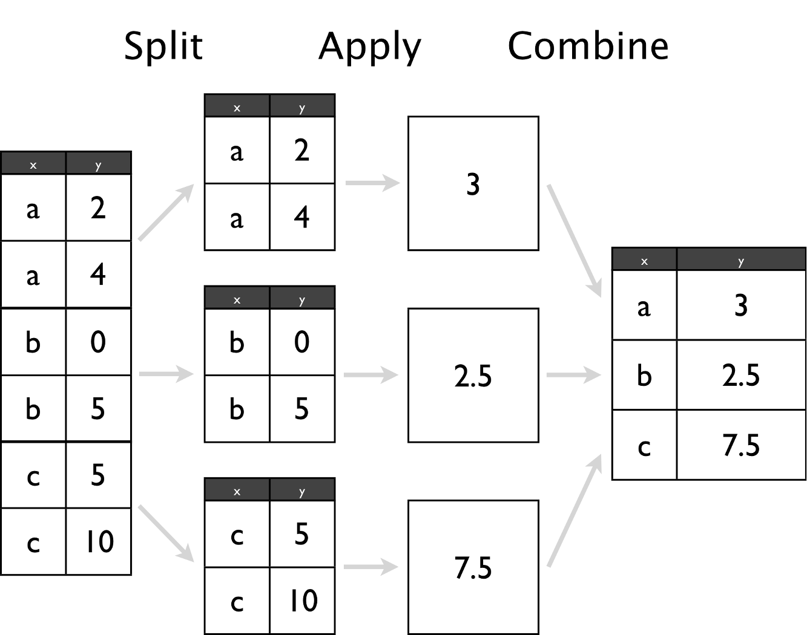

```{r setup, include=FALSE}
knitr::opts_chunk$set(echo = T, comments = T, collapse = T, cache = T)
```

# Reading in Data

## Setup

```{r, eval = T}
# Setup.R file
source("https://bit.ly/2i8sicn")
```

## Data in Excel

Formats xlsx and csv - what's the difference?

- File extensions xls and xlsx are proprietary Excel formats, binary files
- csv is an extension for Comma Separated Value files. They are text files - directly readable.

- Example: Gas prices in midwest since 1994


## Gas Prices in the Midwest

```{r, echo = 2:3}
midwest <- read.csv("https://srvanderplas.github.io/NPPD-Analytics-Workshop/03.DataManipulation/data/midwest.csv")
midwest <- read.csv("https://bit.ly/2hwWiQ8")
head(midwest)
```


## Gas Prices

```{r}
str(midwest)
```

There is clearly some work to be done...

***
### `read.csv` vs. `read.table`

`read.csv` is really just a wrapper for `read.table` with certain parameters set:

```{r}
read.csv
```

So to properly read in this data, it's probably best to use `read.table` directly

```{r, eval=FALSE}
?read.table
```


## Your Turn {.yourturn  data-background=#527a7a}

Have a look at the parameters of read.table (?read.table) to solve the following problems:

1. Read the first two lines of the file into an object called `midwest_names`
2. Read everything EXCEPT the first two lines into an object called `midwest_data`

```{r, echo=FALSE}
midwest_names <- read.table("https://bit.ly/2hwWiQ8", nrows = 2, sep = ",", stringsAsFactors = FALSE)
midwest_data <- read.table("https://bit.ly/2hwWiQ8", skip = 2, sep = ",", stringsAsFactors = FALSE)
```

## Solutions {.solutions  data-background=#527a7a}
1. Read the first two lines of the file into an object called `midwest_names`
```{r}
midwest_names <- read.table("https://bit.ly/2hwWiQ8", 
                            nrows = 2, sep = ",", 
                            stringsAsFactors = FALSE)
```

2. Read everything EXCEPT the first two lines into an object called `midwest_data`
```{r}
midwest_data <- read.table("https://bit.ly/2hwWiQ8", 
                           skip = 2, sep = ",", 
                           stringsAsFactors = FALSE)
```


## Demo: Data Cleaning

```{r, warning=FALSE, message=FALSE}
values <- c(midwest_data$V3, midwest_data$V5, midwest_data$V7, 
            midwest_data$V9, midwest_data$V11)
dates <- c(paste(midwest_data$V1, midwest_data$V2, sep = "-"), 
           paste(midwest_data$V1, midwest_data$V4, sep = "-"),
           paste(midwest_data$V1, midwest_data$V6, sep = "-"),
           paste(midwest_data$V1, midwest_data$V8, sep = "-"),
           paste(midwest_data$V1, midwest_data$V10, sep = "-"))

dates <- dates[!is.na(values)]
values <- values[!is.na(values)]

library(lubridate)
dates <- ymd(dates)

midwest_gas <- data.frame(date = dates, price = values)
midwest_gas <- midwest_gas[with(midwest_gas, order(date)), ]
```

\*\* A better way to do this will be shown later \*\*

## Make a plot
```{r, warning=FALSE, message=FALSE, fig.width=7, fig.height=4}
library(ggplot2)
qplot(date, price, data = midwest_gas, geom = "line")
```


## Reading Excel Data

```{r, eval=FALSE}
library(readxl)
download.file(url = "http://bit.ly/2ihV8Ye", 
              destfile = "midwest.xls")

midwest2 <- read_excel("midwest.xls")
# Fix name issues
names(midwest2) <- make.names(names(midwest2))
head(midwest2, 4)
```

```{r, echo=FALSE}
library(readxl)

midwest2 <- read_excel("./data/midwest.xls")
names(midwest2) <- make.names(names(midwest2))
head(midwest2, 4)
```


## `foreign` Package

Other file formats can be read using the functions from package `foreign`

- SPSS: `read.spss`
- SAS: `read.xport`
- Minitab: `read.mtp`


## Your Turn {.yourturn  data-background=#527a7a}

The NHANES (National Health and Nutrition Survey) publishes data in the SAS xport format:

http://wwwn.cdc.gov/Nchs/Nhanes/Search/nhanes13_14.aspx

1. Scroll to the bottom, choose one of the datasets (Demographics, Examination, etc.). Download the Data file (XPT)
2. Use `read.xport()` to load the file into R

## Solutions {.solutions  data-background=#527a7a}
```{r, eval = F}
download.file("https://wwwn.cdc.gov/Nchs/Nhanes/2013-2014/DEMO_H.XPT", "DEMO.XPT")
library(foreign)
demographic.vars <- read.xport("DEMO.XPT")
```

## Your Turn {.yourturn  data-background=#527a7a}

MINITAB publishes several sample data sets. Download the Paint hardness data

http://support.minitab.com/en-us/datasets/PaintHardness.MTW

and read it in to R.

## Solutions {.solutions  data-background=#527a7a}
```{r}
# download.file("http://support.minitab.com/en-us/datasets/PaintHardness.MTW", "paint.MTW")
# library(foreign)
# demographic.vars <- read.mtp("paint.MTW")
```

# Summarizing Data

## Baseball Data

- The `plyr` package contains the data set `baseball`
- seasonal batting statistics of all major league players (through 2007)
 
```{r}
data(baseball, package = "plyr")
help(baseball, package = "plyr")
head(baseball)
```

## Baseball Data

- Goal: create career summary statistics for each player
- Plan: subset on a player, and compute statistics

```{r}
ss <- subset(baseball, id == "sosasa01")
head(ss, 3)
mean(ss$h / ss$ab)
```

There should be an **automatic** way to calculate this.


## `for` loops

- Idea: repeat the same (set of) statement(s) for each element of an index set
- Setup: 
    - Introduce counter variable (sometimes named `i`)
    - Reserve space for results
- Generic Code:

```{r, eval=FALSE}
result <- rep(NA, length(indexset))
for (i in indexset) {
  ... some statements ...
  result[i] <- ...
}
```
    
## `for` loops for Baseball

- Index set: player id
- Setup: 

```{r}
players <- unique(baseball$id)
n <- length(players)

ba <- rep(NA, n)

for (i in 1:n) {
  career <- subset(baseball, id == players[i])
  ba[i] <- with(career, mean(h / ab, na.rm = TRUE))
}

summary(ba)
```

## `for` loops for Baseball

- Index set: player id
- `i = 0`: 

```{r}
players <- unique(baseball$id)
n <- length(players)

ba <- rep(NA, n)

head(ba)
```

## `for` loops for Baseball

- Index set: player id
- `i = 1`: 

```{r}
players <- unique(baseball$id)

ba <- rep(NA, length(players))

for (i in 1:1) {
  career <- subset(baseball, id == players[i])
  ba[i] <- with(career, mean(h / ab, na.rm = TRUE))
}

head(ba)
```

## `for` loops for Baseball

- Index set: player id
- `i = 2`: 

```{r}
players <- unique(baseball$id)

ba <- rep(NA, length(players))

for (i in 1:2) {
  career <- subset(baseball, id == players[i])
  ba[i] <- with(career, mean(h / ab, na.rm = TRUE))
}

head(ba)
```


## `for` loops for Baseball

- Index set: player id
- `i = 3`: 

```{r}
players <- unique(baseball$id)

ba <- rep(NA, length(players))

for (i in 1:3) {
  career <- subset(baseball, id == players[i])
  ba[i] <- with(career, mean(h / ab, na.rm = TRUE))
}

head(ba)
```


## Your Turn {.yourturn data-background=#527a7a}

- MLB rules for the greatest all-time hitters are that players have to have played 
    - at least 1000 games 
    - with at least 1000 at-bats in order to be considered
- Extend the for loop above to collect the additional information
- Introduce and collect data for two new variables: `games` and `atbats`

## Solution {.solutions data-background=#527a7a}

```{r}
library(dplyr)
data(baseball, package = "plyr")


players <- unique(baseball$id) 
ba <- rep(NA, length(players)) 
games <- rep(NA, length(players)) 
atbats <- rep(NA, length(players)) 
for (i in 1:length(players)) { 
  career <- subset(baseball, id == players[i]) 
  ba[i] <- with(career, mean(h / ab, na.rm = TRUE)) 
  games[i] <- with(career, sum(g, na.rm = TRUE))
  atbats[i] <- with(career, sum(ab, na.rm = TRUE))
}
	
```

***
### How did it go? What was difficult?

- Household chores (declaring variables, setting values each time) distract from real work
- Indices are error-prone
- Loops often result in slow code because R can compute quantities using entire vectors in an optimized way


## Summarise

A special function: `summarise` or `summarize`

```{r, message=FALSE}
library(dplyr)

baseball <- read.csv("https://bit.ly/2iFyIwL")

summarise(baseball,
          ba = mean(h / ab, na.rm = TRUE),
          games = sum(g, na.rm = TRUE),
          hr = sum(hr, na.rm = TRUE),
          ab = sum(ab, na.rm = TRUE))
```

## More Summarise

```{r}
summarise(subset(baseball, id == "sosasa01"), 
          ba = mean(h / ab, na.rm = TRUE),
          games = sum(g, na.rm = TRUE),
          hr = sum(hr, na.rm = TRUE),
          ab = sum(ab, na.rm = TRUE))
```

## `dplyr` + `Summarise`

- A powerful combination to create summary statistics

```{r}
careers <- summarise(group_by(baseball, id),
                 ba = mean(h / ab, na.rm = TRUE),
                 games = sum(g, na.rm = TRUE),
                 homeruns = sum(hr, na.rm = TRUE),
                 atbats = sum(ab, na.rm = TRUE))

head(careers)
```

## Pipes
Rather than nesting functions(inside(each(other))), use a pipe `%>%`:
```{r}
careers <- baseball %>%
  group_by(id) %>%
  summarize(
    ba = mean(h / ab, na.rm = TRUE),
    games = sum(g, na.rm = TRUE),
    homeruns = sum(hr, na.rm = TRUE),
    atbats = sum(ab, na.rm = TRUE)
  )
```

Pipes make code more readable and easier to understand.

## Pipes
`a %>% function(b)`    
is the same as     
`function(a, b)`:

the piped variable is substituted for the first function argument. 

If the argument passed in is not the first argument, use `.`:    
`b %>% function(a, .)`    
is the same as    
`function(a, b)`

## Your Turn {.yourturn data-background=#527a7a}

- Find some summary statistics for each of the teams (variable `team`)
    - How many different (`unique`) players has the team had?
    - What was the team's first/last season?
- Challenge: Find the number of players on each team over time. Does the number change?


## Solutions {.solutions data-background=#527a7a}
1. Find some summary stats for each of the teams (`team`)
    - How many `unique` players has the team had?
    - What was the team's first/last season?
```{r}
baseball %>% 
  group_by(team) %>% 
  summarise(
    nplayer = length(unique(id)), 
    first = min(year), 
    last = max(year))
```


## Solutions {.solutions data-background=#527a7a}
2. Challenge: Find the number of players on each team over time. Does the number change?

```{r, echo = 1, fig.width = 7, fig.height = 3}
players.per.year <- baseball %>% 
  group_by(team, year) %>% 
  summarize(nplayer = n()) 

ggplot(data = players.per.year) + 
  geom_point(aes(x = year, y = nplayer, color = team)) + 
  geom_smooth(aes(x = year, y = nplayer)) + 
  scale_color_discrete(guide = F)
```

# Transforming and Analyzing Data

## Data Housekeeping

80% of data analysis is spent on the process of cleaning and preparing the data.

[](https://www.nytimes.com/2014/08/18/technology/for-big-data-scientists-hurdle-to-insights-is-janitor-work.html)

“Tidy datasets are all alike but every messy dataset is messy in its own way.” – Hadley Wickham


## French Fries
During a ten week sensory experiment, 12 individuals were asked to assess taste of french fries on several scales:

How ____ do the fries taste?

- potato-y
- buttery
- grassy
- rancid
- paint-y

## French Fries

- 3 different oils
- 2 replicates
- 12 individuals
- 10 weeks
- 5 qualities to rate

Each week, each individual tasted 6 batches of french fries. 

```{r}
french_fries <- read.csv("https://bit.ly/2hOI890")
head(french_fries)
```

## Issues

This format is not ideal for data analysis

```{r, fig.width=7, fig.height=2, warning=FALSE}
library(ggplot2)

qplot("1_buttery", buttery, data = french_fries, fill = I("red"), geom = "boxplot") +
    geom_boxplot(aes(x = "2_grassy", y = grassy), fill = I("orange")) +
    geom_boxplot(aes(x = "3_painty", y = painty), fill = I("yellow")) +
    geom_boxplot(aes(x = "4_potato", y = potato), fill = I("green")) +
    geom_boxplot(aes(x = "5_rancid", y = rancid), fill = I("blue")) +
    xlab("variable") + ylab("rating")
```


## Tidy Data

Data which follows these rules is "tidy" and easier to work with in R:

- Each variable in the data set is placed in its own column
- Each observation is placed in its own row
- Each value is placed in its own cell

## Ideal Data

The french fry data is in **wide format** 


and should be in **long format** for plotting


This is done using the `gather` function.

## Gathering

When gathering, specify the **keys** (identifiers) and the **values** (measures).

#### Keys/Identifiers:

- Identify a record (must be unique)
- Example: Indices on an random variable
- Fixed by design of experiment (known in advance)
- May be single or composite (may have one or more variables)

## Gathering 

When gathering, specify the **keys** (identifiers) and the **values** (measures).

#### Values/Measures:

- Collected during the experiment (not known in advance)
- Usually numeric quantities


## Gathering 
### French Fry Data

```{r}
library(tidyr)

french_fries_long <- gather(french_fries, 
                            key = variable, 
                            value = rating, 
                            potato:painty)

head(french_fries_long)
```

## Gathering
Plotting is much easier with long format data:

```{r, fig.width=7, fig.height=3.5, warning=FALSE}
qplot(variable, rating, data = french_fries_long, 
      fill = variable, geom = "boxplot")
```

## Long to Wide

In certain applications, a wide dataset may be preferable (e.g. to display in a table).

```{r}
head(french_fries_long)
```


## Spread

The `spread` function (from `tidyr`) is used to do this:

```{r}
french_fries_wide <- spread(french_fries_long, 
                            key = variable, value = rating)

head(french_fries_wide)
```


## Your Turn {.yourturn data-background=#527a7a}
Read in the billboard top 100 music data
```{r}
billboard <- read.csv("https://bit.ly/2hQGDao")
```

1. Use `tidyr` to convert this data into a long format.
2. Use ``ggplot2`` to create this time series plot:

```{r, echo=FALSE, fig.width=7, fig.height=3, warning=FALSE}
long_billboard <- gather(billboard, key = week, value = rank, X1:X76)
long_billboard$week <- as.numeric(gsub("X", "", long_billboard$week))

qplot(week, rank, data = long_billboard, geom = "line", colour = artist, group = track) +
    xlim(c(0, 30))
```

## Solutions {.yourturn data-background=#527a7a}
1. Use `tidyr` to convert this data into a long format.
```{r}
long_billboard <- gather(billboard, 
                         key = week, value = rank, 
                         X1:X76)

# Convert weeks to numeric variables
long_billboard$week <- long_billboard$week %>%
  gsub("X", "", .) %>%
  as.numeric()

# Get rid of NAs:
long_billboard <- long_billboard %>% na.omit()
```


## Solutions {.yourturn data-background=#527a7a}
2. Use `ggplot2` to create this time series plot:
```{r, fig.width=7, fig.height=3, warning=FALSE}
qplot(x = week, y = rank, 
      colour = artist, group = track, 
      data = long_billboard, geom = "line")
```


## Split-Apply-Combine

- *Split* a dataset into many smaller sub-datasets
- *Apply* some function to each sub-dataset
- *Combine* the results of the function calls    
into one dataset

</img>

## Split-Apply-Combine
### Using `dplyr`

```{r, message=FALSE, warning=FALSE}
library(dplyr)

french_fries_rating <- french_fries_long %>%
  # SPLIT:
  group_by(variable) %>% 
  # APPLY + COMBINE:
  summarize(rating = mean(rating, na.rm = T)) 

french_fries_rating
```


## `dplyr` verbs

There are five primary `dplyr` **verbs**, representing distinct data analysis tasks:

- `filter`: Keep only a subset of a data frame
- `arrange`: Reorder the rows of a data frame
- `select`: Select particular columns of a data frame
- `mutate`: Add new columns computed from existing cols
- `summarise`: Create collapsed summaries of a data frame
    
## Filter

```{r}
french_fries %>%
  filter(subject == 3, time == 1)
```

## Arrange

```{r}
french_fries %>%
  arrange(desc(rancid)) %>%
  head
```

## Select

```{r}
french_fries %>%
  select(time, treatment, subject, rep, potato) %>%
  head
```

## Mutate

```{r}
french_fries %>%
  mutate(rancid2 = rancid^2) %>%
  select(time, treatment, subject, rancid, rancid2) %>%
  head
```

## Summarise

```{r}
french_fries %>%
    group_by(time, treatment) %>%
    summarise(mean_rancid = mean(rancid), 
              sd_rancid = sd(rancid))
```


## Your Turn {.yourturn data-background=#527a7a}
This dataset contains information on over 300,000 flights that departed from New York City in the year 2013.

```{r}
flights <- read.csv("https://bit.ly/2hzhAfW")
```

1. Using `dplyr` and the pipe operator (`%>%`), create a data frame consisting of the average arrival delay (`arr_delay`) based on the destination airport (`dest`).    
Sort this data frame in descending order, so the destination airport with the largest delay is first.
2. Find out the most used airports for each airline carrier.


## Solutions {.solutions data-background=#527a7a}
1. Create a data frame consisting of the average arrival delay (`arr_delay`) based on the destination airport (`dest`).     
Sort this data frame in descending order, so the destination airport with the largest delay is first. 
```{r}
flights %>% 
  group_by(dest) %>% 
  summarise(avg_delay = mean(na.omit(arr_delay))) %>% 
  arrange(desc(avg_delay))
```


## Solutions {.solutions data-background=#527a7a}
2. Find out the most used airports for each airline carrier.

```{r}
by.origin <- flights %>% 
  group_by(carrier, origin) %>% 
  summarise(count = n()) %>% 
  ungroup() %>% group_by(carrier) %>% 
  filter(count == max(count)) %>% 
  rename(mostused = origin) %>%
  mutate(kind = "origin")

by.dest <- flights %>% 
  group_by(carrier, dest) %>% 
  summarise(count = n()) %>% 
  ungroup() %>% group_by(carrier) %>% 
  filter(count == max(count)) %>% 
  rename(mostused = dest) %>% 
  mutate(kind = "dest")
```

## Solutions {.solutions data-background=#527a7a}
2. Find out the most used airports for each airline carrier.

```{r}
mostused <- bind_rows(by.origin,by.dest)

mostused %>% group_by(carrier) %>% 
  filter(count == max(count)) %>% ungroup() %>%
  arrange(desc(count)) 
```


## Dates and Times

Dates are deceptively hard to work with.

**Example**: 02/05/2012. Is it February 5th, or May 2nd?

Other things are difficult too:

- Time zones
- POSIXct format in base R is challenging

The **lubridate** package helps tackle some of these issues.

## Basic Lubridate Use

```{r, results='hold', message=FALSE}
library(lubridate)

now()
today()
now() + hours(4)
today() - days(2)
```

## Parsing Dates

```{r, results='hold'}
ymd("2013-05-14")
mdy("05/14/2013")
dmy("14052013")
ymd_hms("2013:05:14 14:50:30", tz = "America/Chicago")
```

## Your Turn {.yourturn data-background=#527a7a}

1. Using the `flights` data, create a new column Date using lubridate. Paste together the columns year, month, and day in order to do this. See the `paste` function.
2. Use `dplyr` to calculate the average departure delay for each date.
3. Plot the date versus the average departure delay

```{r, echo=FALSE, fig.width=7, fig.height=3}
flights$date <- ymd(paste(flights$year, flights$month, flights$day, sep = "-"))
delay.dat <- flights %>% 
    group_by(date) %>% 
    summarise(dep_delay = mean(dep_delay, na.rm = TRUE))

qplot(date, dep_delay, geom = "line", data = delay.dat)
```

## Solutions {.solutions data-background=#527a7a}

1. Using the `flights` data, create a new column Date using lubridate.

```{r}
flights$date <- paste(flights$year, flights$month, flights$day, 
                      sep = "-") %>%
  ymd() # Convert from character to date format
```

2. Use `dplyr` to calculate the average departure delay for each date.

```{r}
delay.dat <- flights %>% 
    group_by(date) %>% 
    summarise(dep_delay = mean(dep_delay, na.rm = TRUE))
```

## Solutions {.solutions data-background=#527a7a}
3. Plot the date versus the average departure delay

```{r, fig.width = 7, fig.height = 3}
qplot(date, dep_delay, geom = "line", data = delay.dat)
```
